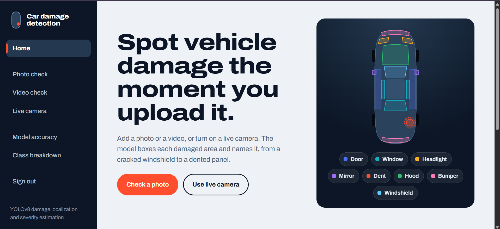
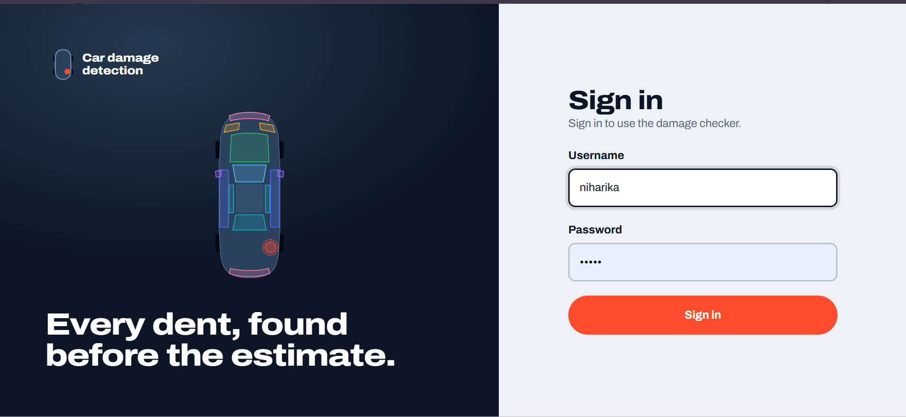
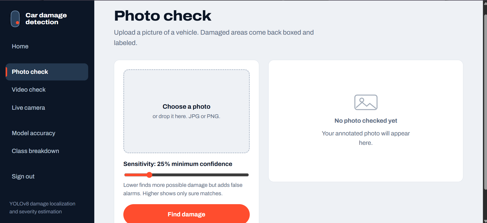
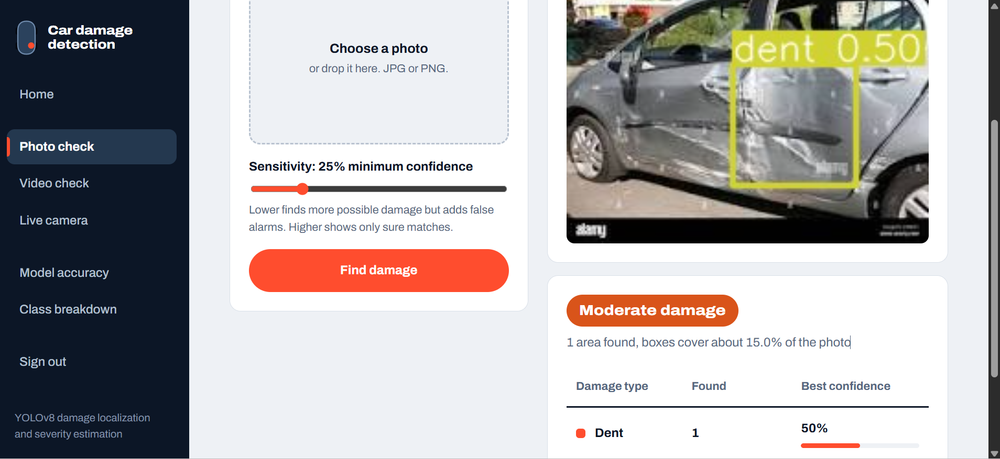
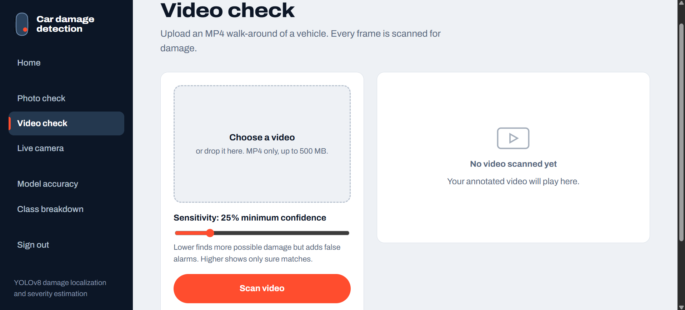
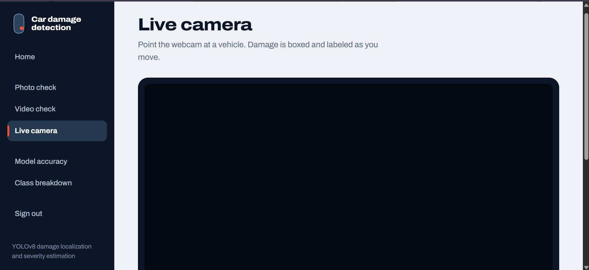
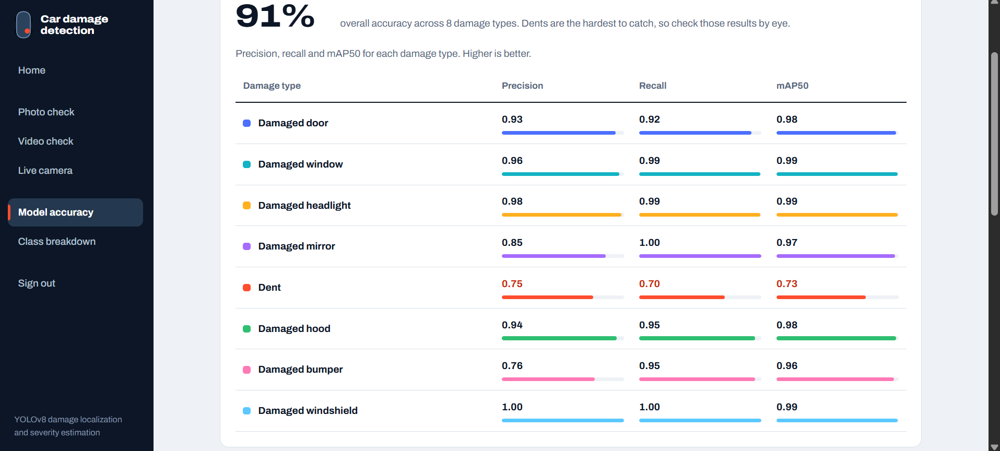

<div align="center">
  
# 🚗 Car Damage Detection using YOLOv8

### An AI-powered vehicle damage detection system that identifies and classifies car damage from images, videos, and live webcam feeds using a custom-trained YOLOv8 model.

<p>


</p>

---

## 📖 Overview

**Car Damage Detection** is an AI-powered computer vision web application that automatically detects and classifies damaged areas on vehicles.

The system uses a **custom-trained YOLOv8 object detection model** to identify eight different types of vehicle damage from images, videos, and live webcam feeds.

### Key Capabilities

- 🚗 Vehicle damage detection
- 📦 Bounding-box localization
- 🎯 Confidence score detection
- ⚠️ Rule-based damage severity estimation
- 🎥 Video damage detection
- 📷 Real-time webcam detection
- 📊 Model performance analysis

The web application is built using **Flask**, with **YOLOv8, OpenCV, and Pillow** handling the computer vision pipeline.

---

## ✨ Features

- 🚗 YOLOv8-based vehicle damage detection
- 🖼️ Image-based damage detection
- 🎥 Video-based damage detection
- 📷 Real-time webcam detection
- 🎯 Adjustable detection confidence
- 📦 Bounding-box localization
- 📊 Damage confidence scores
- ⚠️ Rule-based severity estimation
- 📈 Precision, Recall, and mAP50 analysis
- 🧩 Eight vehicle damage categories
- 🔐 Server-side authentication
- 📱 Responsive web interface

---

## 🛠️ Tech Stack

| Category | Technologies |
|---|---|
| **Programming Language** | Python |
| **Web Framework** | Flask |
| **Object Detection** | YOLOv8 |
| **Computer Vision** | OpenCV |
| **Image Processing** | Pillow |
| **Frontend** | HTML, CSS, JavaScript |
| **Model** | Custom-trained YOLOv8 |
| **Authentication** | Flask Session Authentication |
| **Development** | VS Code, Git, GitHub |

---

## 🎯 Damage Classes

The trained YOLOv8 model detects **8 types of vehicle damage**:

| # | Damage Type |
|---:|---|
| 1 | Damaged Door |
| 2 | Damaged Window |
| 3 | Damaged Headlight |
| 4 | Damaged Mirror |
| 5 | Dent |
| 6 | Damaged Hood |
| 7 | Damaged Bumper |
| 8 | Damaged Windshield |

---

## 📸 Application Preview

### 🏠 Home

The home page provides access to the vehicle damage detection features and supported detection modes.

<p align="center">
  
</p>

### 🔐 Login

Server-side authentication protects the damage detection features.

<p align="center">
  
</p>

### 🖼️ Photo Check

Users can upload a vehicle image and adjust the minimum confidence threshold before running detection.

<p align="center">
  
</p>

### 🔍 Photo Detection Result

The system displays the detected damage with bounding boxes, damage labels, confidence scores, and estimated severity.

<p align="center">
  
</p>

### 🎥 Video Check

Vehicle videos can be processed frame-by-frame to generate an annotated output video.

<p align="center">
  
</p>

### 📷 Live Camera

The application supports real-time vehicle damage detection using a connected webcam.

<p align="center">
  
</p>

### 📊 Model Accuracy

Class-wise model performance is displayed using Precision, Recall, and mAP50.

<p align="center">
  
</p>

---

## 📈 Model Performance

The custom-trained YOLOv8 model reports the following performance across the eight damage classes:

| Damage Type | Precision | Recall | mAP50 |
|---|---:|---:|---:|
| Damaged Door | 0.93 | 0.92 | 0.98 |
| Damaged Window | 0.96 | 0.99 | 0.99 |
| Damaged Headlight | 0.98 | 0.99 | 0.99 |
| Damaged Mirror | 0.85 | 1.00 | 0.97 |
| Dent | 0.75 | 0.70 | 0.73 |
| Damaged Hood | 0.94 | 0.95 | 0.98 |
| Damaged Bumper | 0.76 | 0.95 | 0.96 |
| Damaged Windshield | 1.00 | 1.00 | 0.99 |

### Overall Performance

**Reported overall accuracy: 91%**

The **Dent** class has comparatively lower reported precision, recall, and mAP50 and may require additional verification.

---

## ⚙️ How It Works

The YOLOv8 model processes an input image or video frame and predicts:

```text
Input Image / Video Frame
          ↓
      YOLOv8 Model
          ↓
   Bounding Box Detection
          ↓
      Damage Class
          ↓
    Confidence Score
          ↓
   Severity Estimation
          ↓
     Detection Result
```

For image input, detected damage is displayed with bounding boxes and labels.

For video input, the model processes individual frames and generates an annotated output video.

For webcam input, the detection pipeline continuously processes incoming camera frames.

---

## ⚠️ Severity Estimation

The application includes a simple **rule-based severity estimation system**.

Severity is estimated using the area covered by detected bounding boxes relative to the total image area.

```text
Total Area of Detected Boxes
----------------------------- × 100
        Total Image Area
```

| Damage Coverage | Severity |
|---:|---|
| No detections | None |
| Under 5% | Minor |
| 5% – 15% | Moderate |
| Over 15% | Severe |

> Severity estimation is rule-based and is not learned by the YOLOv8 model.

---

## 📂 Project Structure

```text
vehicle_damage_detection/
│
├── app.py
├── best.pt
├── requirements.txt
├── README.md
├── Accuracy.txt
│
├── screenshots/
│   ├── 01-home.png
│   ├── 02-login.png
│   ├── 03-photo-check.png
│   ├── 04-photo-result.png
│   ├── 05-video-check.png
│   ├── 06-live-camera.png
│   └── 07-model-accuracy.png
│
├── templates/
│   ├── base.html
│   ├── first.html
│   ├── login.html
│   ├── image.html
│   ├── video.html
│   ├── webcam.html
│   ├── performance.html
│   └── chart.html
│
├── static/
│   ├── css/
│   │   └── theme.css
│   ├── js/
│   │   └── app.js
│   ├── confusion_matrix.png
│   └── results/
│
├── uploads/
│
├── samples/
│   ├── sample images
│   └── sample video
│
└── model/
    └── Yolov8_object_detection_on_custom_dataset.ipynb
```

---

## 🧠 Model

The project uses a **custom-trained YOLOv8 object detection model**.

### Model Weights

```text
best.pt
```

The trained weights are included in the repository.

### Training Notebook

```text
model/Yolov8_object_detection_on_custom_dataset.ipynb
```

The original training dataset is not included in the repository.

---

## 📁 Sample Files

Sample vehicle images and a sample video are available in:

```text
samples/
```

These files can be used to test the application.

---

## 📄 License

This project is developed for **educational and research purposes**.

---

## 👩‍💻 Author

### Nerusu Sai Niharika

---

<p align="center">

### 🚗 Detect Damage. Understand Severity. Improve Vehicle Assessment.

</p>
